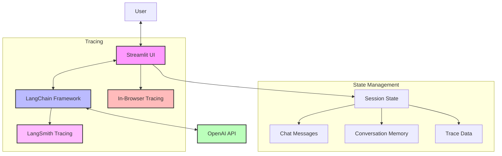
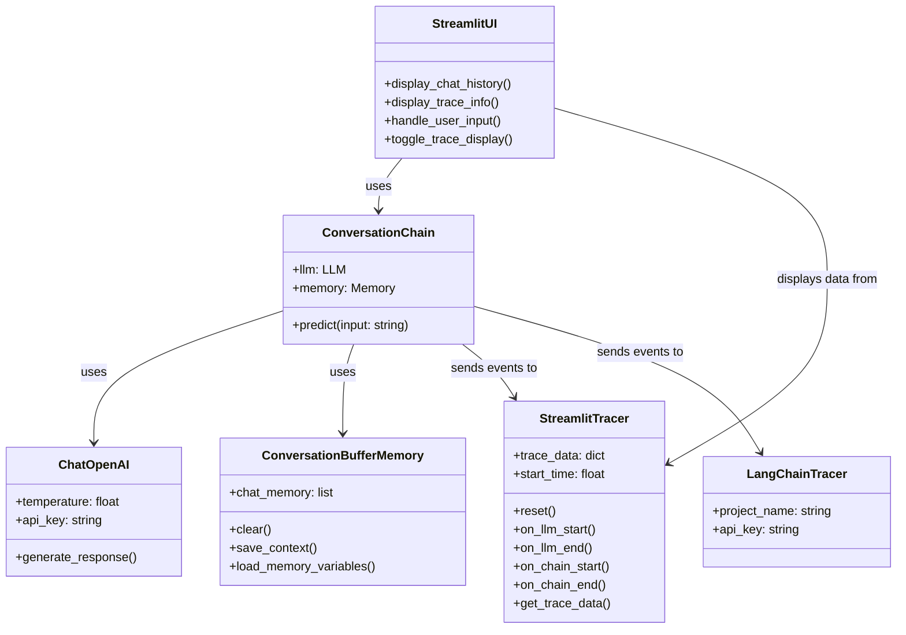
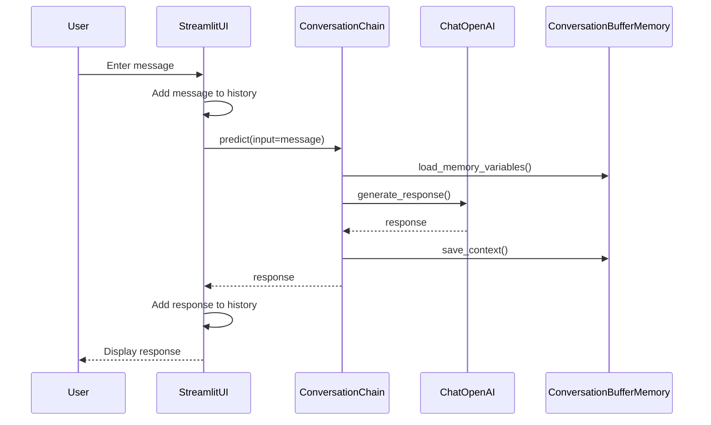
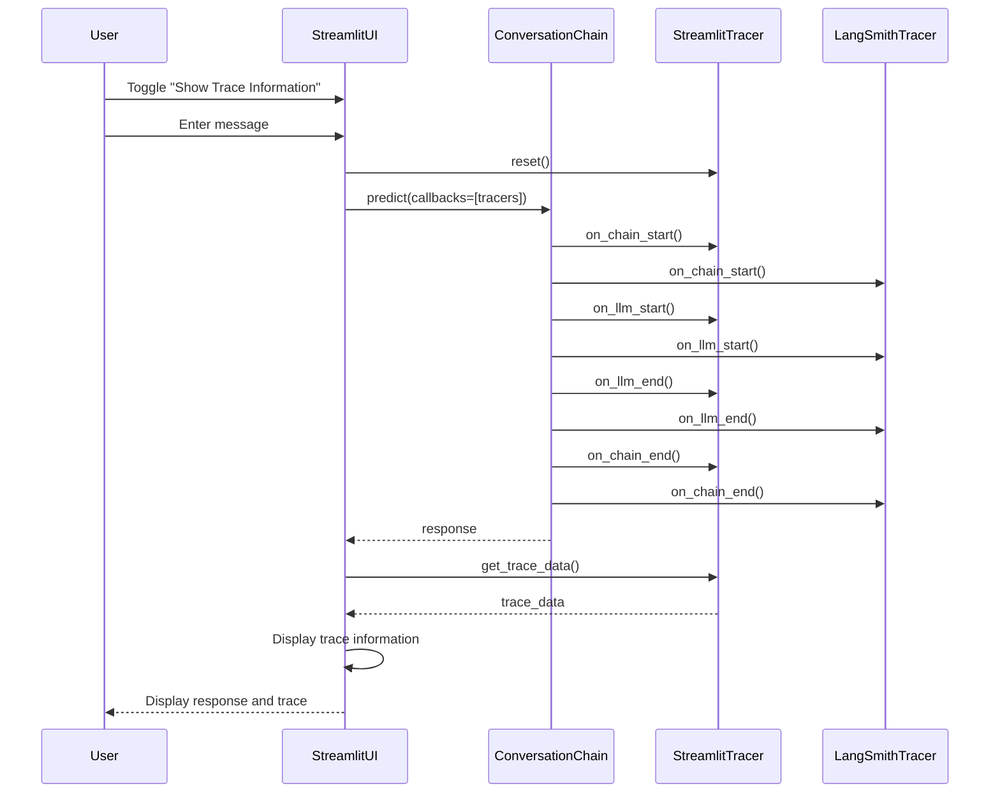
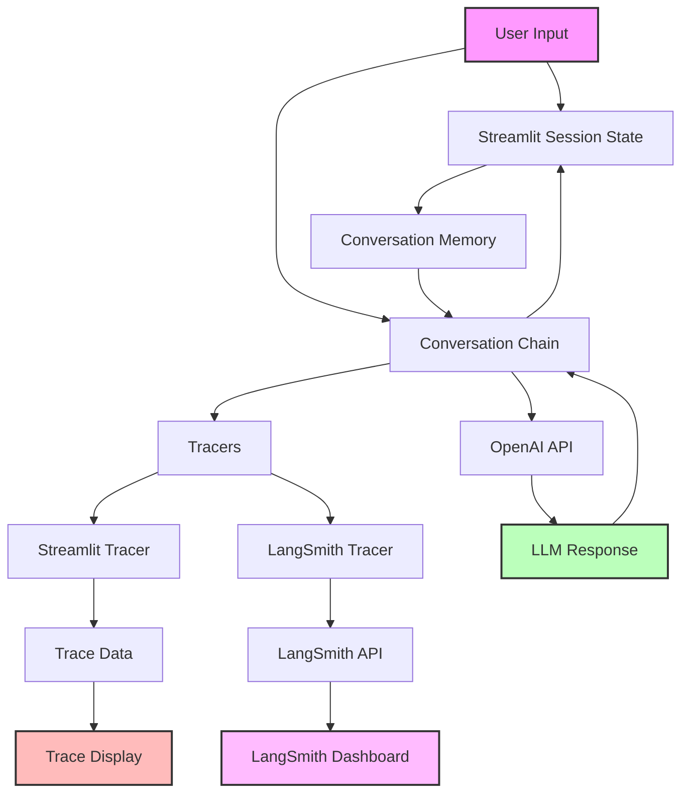
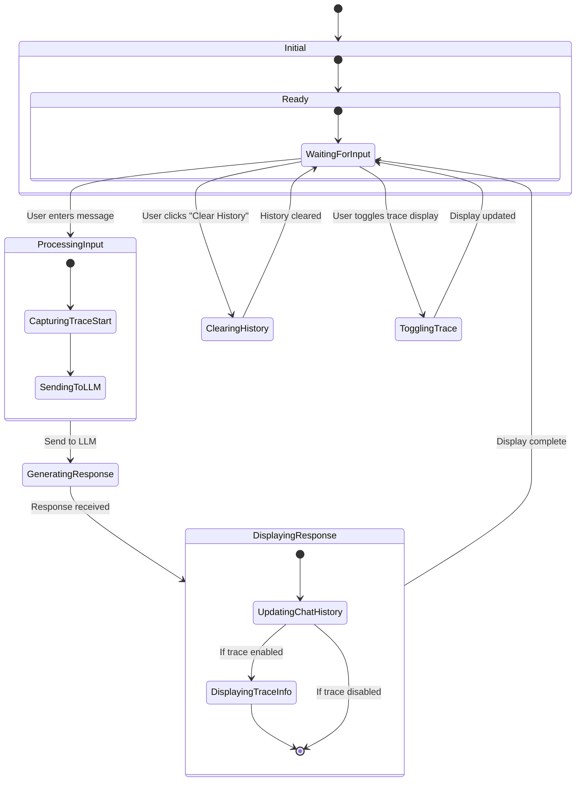
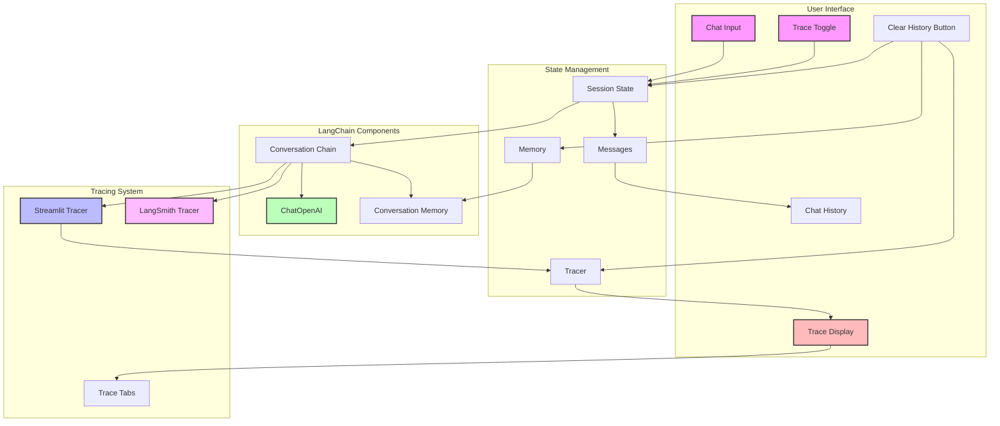
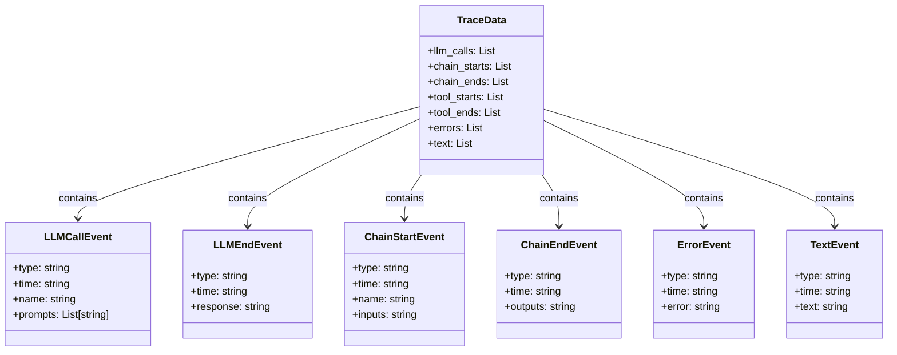

# LangChain Streamlit Chatbot: Diagrams

This document contains diagrams that illustrate the architecture and flow of the LangChain Streamlit Chatbot application.

## Author

**Bharat Kumar Subramanian**
Email: reachbrt@gmail.com

## Architecture Diagram

## Component Diagram

## Sequence Diagram: Basic Conversation Flow

## Sequence Diagram: Tracing Flow

## Data Flow Diagram

## State Transition Diagram

## Component Interaction Diagram

## Trace Data Structure

These diagrams can be rendered using Mermaid-compatible tools or viewers. You can use the [Mermaid Live Editor](https://mermaid.live/) to view and edit these diagrams interactively.
